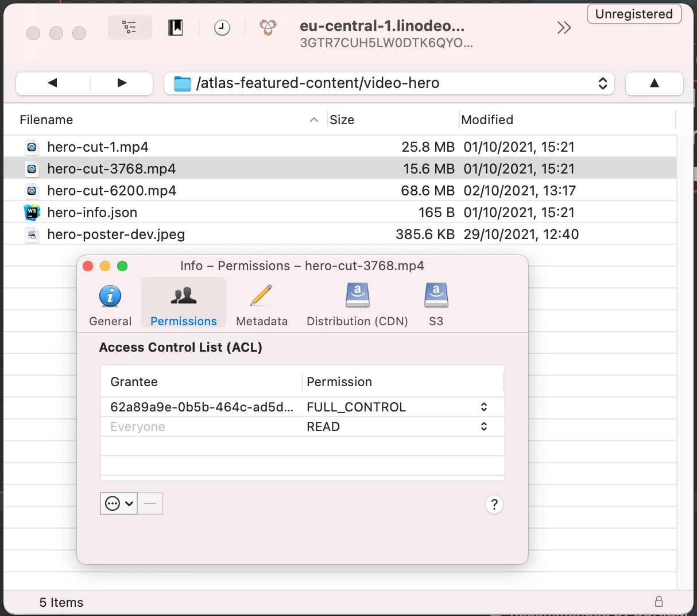

# Featured content in Atlas

## Intro

Atlas mostly relies on blockchain state to display content. However, there are some parts of Atlas that are intended to be controlled by Gateways in the future. To start moving in this direction, some of Atlas content is controlled by Orion (future Gateway Node). This currently includes:

- Video hero (full-width video banner displayed on the home page)
- Featured videos for each video category (accessible via `Discover` view)

## Community process

### Actors

- _Content curators_ - members of the community responsible for preparing suggestions of new featured content
- _Content admin_ - member of the community with required credentials, responsible for making requests to update featured content. They act based on input from _content curators_
- _Reviewer_ - optional actor from JSG responsible for approving some types of featured content

### General process

In general the process for updating the featured content will look as follows:

1. _Content curators_ prepare ideas for new featured content. This includes preparing metadata according to the [structure below](#metadata-structure) and preparing any necessary assets (video cuts, posters, etc.)
2. Optionally, if video hero is affected, video hero propositions should be sent to the _reviewer_ for approval
3. Once all content is ready and optionally approved, _content curators_ should send all required metadata and assets to the _content admin_
4. _Content admin_, using their credentials, makes assets publicly accessible and updates the featured content in Orion
5. Changes are live in Atlas

IMPORTANT NOTE 1: for `category featured videos` the order of these will be the same as taken as the mutation submitted to Orion.

- This means the first featured video (with an accompanying video file) will take the first spot in videos that show a preview.
- For videos submitted with only an ID (and no video file) they will occupy the section below in the order submitted.

IMPORTANT NOTE 2: Anytime a mutation is submitted, it will override whatever was previously set. So if you want to add/remove featured videos from categories, you must list all the ones you do want listed and remove those that you do not want listed anymore.

## Metadata structure

Metadata for video hero and featured videos are saved in Orion's internal database and are later queried by Atlas. This is the data structure:

```graphql
type VideoHero {
  # ID of the original video on Joystream
  videoId: ID!

  # Title to be used inside the video hero section, in most cases should be the same as original video title
  heroTitle: String!

  # URL of video preview prepared for video hero section
  # The video cut should be of sufficient quality, it will be displayed in full-screen-width section
  heroVideoCutUrl: String!

  # URL of poster image that should be used when video preview is not playing
  # Needs to be of sufficient quality, ideally at least 1080px wide
  heroPosterUrl: String!
}

type FeaturedVideo {
  # ID of the original video on Joystream
  videoId: ID!

  # URL of video preview prepared for featuring
  # The video cut should be of sufficient quality, it will be displayed in full-screen-width section
  # Not all featured videos need to have this set, however there always should be at least one video with video preview for each video category
  videoCutUrl: String
}

type Query {
  # Query current video hero
  videoHero: VideoHero!

  # Query current featured videos for a given category ID
  categoryFeaturedVideos(categoryId: ID!): [FeaturedVideo!]!
}
```

## Featured assets

Other than the metadata mentioned above, some featured content will also require additional assets, for example short preview cut of video hero or poster image specifically for video hero section. To enable hosting those, JSG have prepared an object storage on Linode (S3-compatible). _Content admin_ should have access to this storage and upload any assets prepared by _content curators_ to it. Any URLs in the [metadata structure above](#metadata-structure) should link to this Linode storage.

To access the storage, any S3-compatible client can be used, some good choices are [Cyberduck](https://cyberduck.io/) (UI-based) and [s3cmd](https://s3tools.org/s3cmd-howto]).

When configuring the above tools, you may need to provide the following data:

- storage host URL - `eu-central-1.linodeobjects.com`
- storage bucket URL (for `s3cmd`) - `%(bucket).eu-central-1.linodeobjects.com`
- bucket name - `atlas-featured-content`
- access key - use yours
- secret key - use yours

Example of uploading a file via `s3cmd`:

```shell
s3cmd put hero-cut-1234.webm s3://atlas-featured-content/video-hero/hero-cut-1234.webm
```

**Note:** please make sure all content uploaded to Linode is publicly accessibly. Currently, by default any file uploaded will be private. To change permissions you will need to grant `READ` permission to `Everyone`, this can also be done in bulk for multiple files. Example of proper permissions in Cyberduck:



## Making requests to Orion

Once all the content is prepared and all the assets are uploaded to Linode, the only thing that's left is to make mutation requests to Orion to save the changes. To do that you want to go to [Orion playground](https://orion.joystream.org/graphql).

**Note:** when setting new content and testing in Atlas, please mind that Atlas will cache featured content from a previous session - after updating you may need to visit Atlas and refresh

### Authorization

All featured content changes require secret credential that should be shared with _content admin_. To use the secret in playground, before running any mutation you want to open the `HTTP Headers` section from the bottom-left corner. Then, in the text area, you want to provide an `Authorization` header like so:

```json
{
  "Authorization": "YOUR_SECRET_TOKEN_HERE"
}
```

### Example mutations

Once the secret is provided, you can run mutations to save the featured content. Here are example mutations:

#### Setting video hero

```graphql
mutation {
  setVideoHero(
    newVideoHero: {
      videoId: "339"
      heroTitle: "Featured video hero title"
      heroVideoCutUrl: "https://eu-central-1.linodeobjects.com/atlas-featured-content/video-hero/hero-cut-1.mp4"
      heroPosterUrl: "https://eu-central-1.linodeobjects.com/atlas-featured-content/video-hero/hero-poster-dev.jpeg"
    }
  ) {
    videoId
    heroTitle
    heroVideoCutUrl
    heroPosterUrl
  }
}
```

Result of this mutation should be the updated video hero

#### Setting featured videos for video category

```graphql
mutation {
  setCategoryFeaturedVideos(
    categoryId: "1"
    videos: [
      {
        videoId: 3768
        videoCutUrl: "https://eu-central-1.linodeobjects.com/atlas-featured-content/category-featured-videos/1/video-cut-3768.mp4"
      }
      { videoId: 283 }
    ]
  ) {
    videoId
    videoCutUrl
  }
}
```

Result of this mutation should be updated featured videos for the given video category
