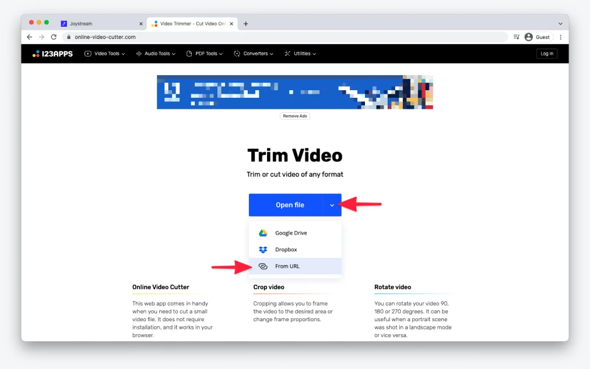

# Trimming down videos files for Atlas hero sections

_Author: @toiletgranny_

The purpose of this document is to provide technical guidance for content curators on trimming down video files to be later displayed in featured videos hero sections on Atlas.

## Video license

Make sure the video is suited for `All audiences` and that its license is one of the following:

- `CC0`
- `PDM`
- `CC_BY`
- `CC_BY_SA`
- `CC_BY_NC`
- `CC_BY_NC_SA`

If the video's license is not listed above, it means it cannot be edited or remixed, thus it can't be trimmed down and be featured in any of our hero sections.

## Trimming video file

Depending on how large your video file is and which operating system you're on, your process for trimming down a video file may differ. We recommend starting with the online option.

### Online

Using a browser-based online tool is the fastest and easiest way to trim down a video file. Please note, that the tool described in this guide comes with a limit of 700 MB per file and can process up to 10 videos per day unless you upgrade to a paid plan. If the above limits are exceeded, feel free to follow macOS or Windows guides below.

#### 1. Copy a link to a video

Right-click in the center of a video player and select `Copy Video Address` to have its URL copied into your clipboard.

#### 2. Open the video in Online Video Cutter

1. Proceed to [Online Video Cutter](https://online-video-cutter.com) from 123Apps.
2. Click on the arrow icon in the `Open file` button, and select `From URL` from the dropdown.
3. Paste the video URL into the newly opened window and wait for the video file to be processed.

#### 3. Select time range

1. Once your video file has been processed, using the timeline (1) underneath the video preview click and drag blue handlers to select the **10 seconds** sample of your choice.
2. For maximum precision, fine-tune your selection using timestamps input fields (2) below the timeline.

#### 4. Export

1. Once you're happy with your selection, click on the cog icon to open up a `File format` popover.
2. Enable the `No re-encoding` option.
3. To export your video, click `Save` in the bottom right corner.

#### 5. Save

Once your video has been processed, click on the `Save` button to save it on your computer. And that's all!

### macOS

The easiest way to trim down a video file on a Mac is to use the built-in QuickTime video player.

#### 1. Download the video

Right-click in the center of a video player and select `Save Video As...` to save it on your computer.

#### 2. Open the video in QuickTime

Open the video file in QuickTime.

#### 3. Select time range

1. To enter trimming mode in QuickTime, go into `Edit -> Trim` from the top menu or hit `⌘T` on your keyboard.
2. Once you're in the trimming mode, use the timeline to click and drag yellow handlers to select the **10 seconds** sample of your choice.
3. For maximum precision, click and hold a yellow handler while not moving your cursor for a brief moment. After a while, you should notice the timeline zooming in and allowing for more granular time adjustments.
4. Once you're happy with your selection, click on the `Trim` button on the right side of the timeline.

#### 4. Save

1. Upon clicking the `Trim` button from a previous step you'll end up with a new `Untitled` video file.
2. To save it, go into `File -> Save` from the top menu or hit `⌘S` on your keyboard. And that's all!

### Windows

The easiest way to trim down a video file on a Mac is to use the built-in QuickTime video player.

#### 1. Download the video

Right-click in the center of a video player and select `Save video as` to save it on your computer.

#### 2. Open the video in Photos

Open the video file in Photos.

#### 3. Enter trimming mode

To enter trimming mode in Photos, click on the three dots icon in the top right corner and select `Trim` from the dropdown.

#### 4. Select time range & save

1. Once you're in the trimming mode, use the timeline to click and drag white dots to select the **10 seconds** sample of your choice.
2. Once you're happy with your selection, click on the `Save as` button in the top right corner. And that's all!
